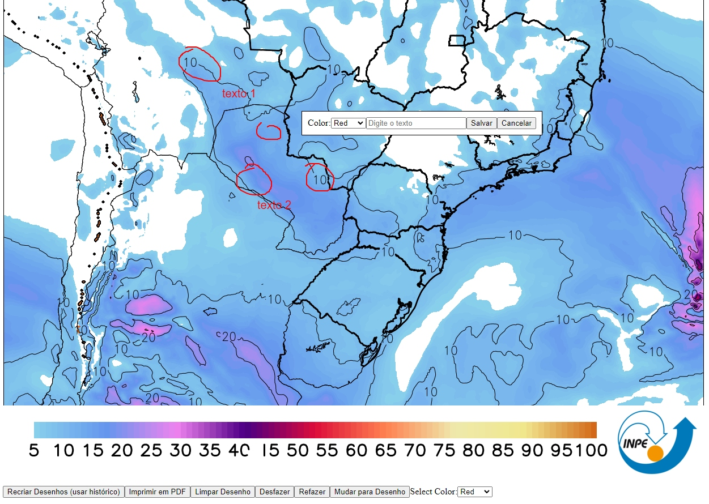

# Desenhar em cima de uma imagem

Este projeto rastreia a posição do mouse, armazenando as coordenadas em um array. Usa o canvas sobreposto à imagem para capturar o desenho. 

Com este projeto é possível desenhar usando o mouse e escrever em uma camada acima da imagem.

Requisitos:

1. Botão para limpar o desenho: Adicionado um botão para limpar o canvas e as coordenadas armazenadas.
2. Manter o desenho ao soltar o clique do mouse: O desenho é mantido no canvas quando o mouse é solto.
3. Desenho separado a cada clique: O desenho atual não será unido ao anterior quando o mouse é clicado novamente.
4. Botão de retornar e avançar: desfaz ou refaz cada desenho.
5. Opção de digitar um texto na imagem
6. Redimensionamento da figura mantendo o texto na escala da janela redimensionada
7. Botão para gerar arquivo PDF da imagem com os desenhos. Os desenhos não perderão resolução se a imagem não estiver redimensionada.
8. Botão para recriar desenhos em uma nova imagem a partir de um array de histórico dos desenhos.