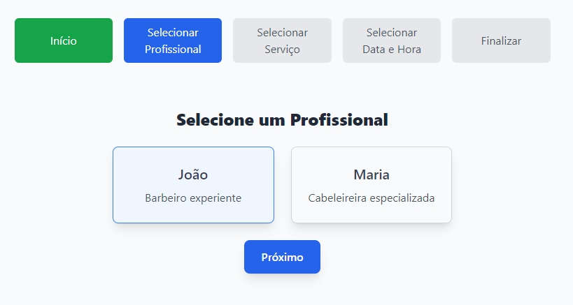
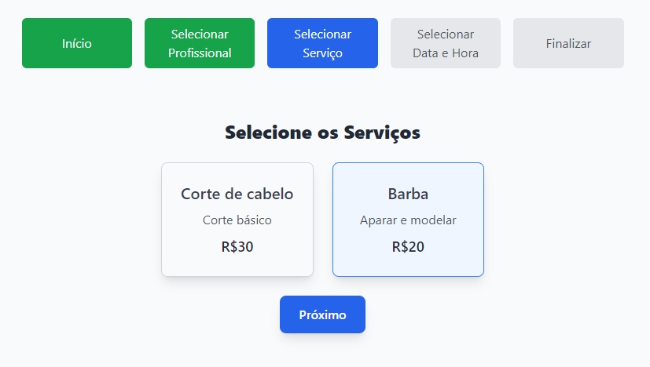
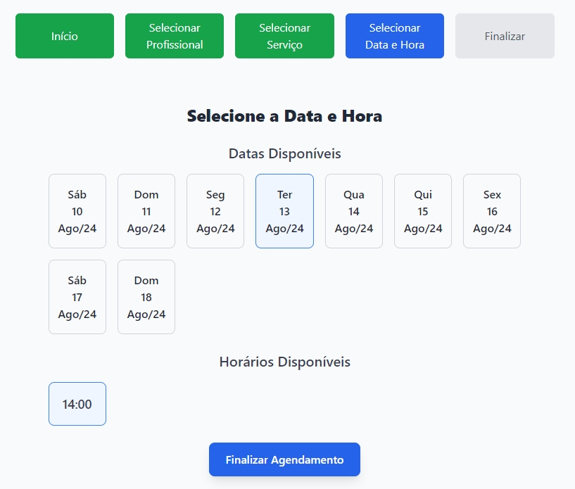

# React + Vite

Projeto de agendamento para salões de beleza e barbearias.

1 - Página inicial do estabelecimento (salão de beleza ou barbearia), com informações diversas

2 - Página para selecionar um profissional que fará o serviço (nome, descrição)



3 - Página para selecionar um ou mais serviços (titulo, descrição, valor)



4 - Página para selecionar o dia e o horário (deverá ser consultado um array com os dias e horários disponíveis). Deveria aparecer os 15 primeiros dias, para ser escolhido (clicando em cima da caixa) E depois selecionar o horário, clicando em cima da caixa.



5 - Página de login com o Google ou email

6 - Página de finalização, exibindo os dados do agendamento (profissional, serviços escolhidos, data e hora e valores dos serviços, e o total a pagar)

Necessário instalar as dependências:

```bash
npm install @react-oauth/google
```
