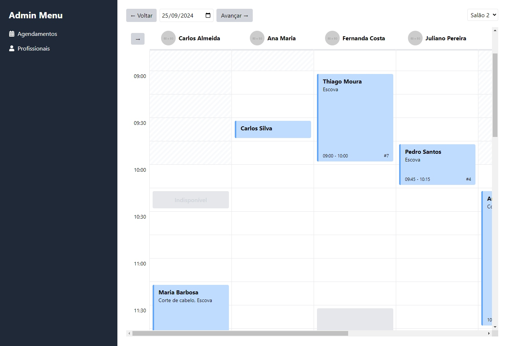

# React + Vite

Layout para sistema de agendamento baseado em JSON. Mantém a primeira coluna e a primeira linha fixa, usando z-index e table-row. Tem funcionalidades como horários livres, horários indisponíveis, agendamentos baseados na duração etc. Informações todas vindas de objetos do tipo JSON.

